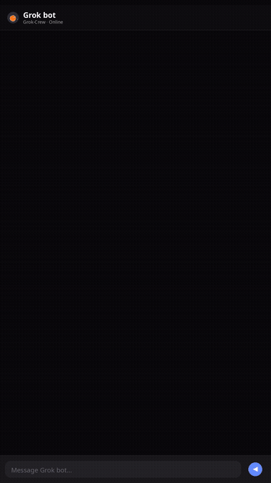

# Grok Crew

<p align="center"><a href="README.md">English</a> &nbsp;·&nbsp; <a href="README.ko.md">한국어</a> &nbsp;·&nbsp; <strong>简体中文</strong> &nbsp;·&nbsp; <a href="README.ja.md">日本語</a></p>

**把粗剪的短视频素材,变成机器人可执行的剪辑方案、本地 MP4 文件,以及可选的 Instagram、TikTok 或 YouTube 上传——无需将项目、素材或机器人历史发送到任何云端。**

<p>
  
  
  
  
</p>

<h2 align="center">观看演示</h2>

<p align="center">
<a href="public/demo/quickstart-chat-demo.mp4"></a>
</p>

<p align="center"><em>一个真实的本地机器人克隆并启动仓库，然后把一句自然语言的请求剪辑成带字幕的竖屏视频。点击可播放完整视频。</em></p>

## 在本地运行

```sh
git clone https://github.com/NoLucas/Grok-Crew.git grok-crew
cd grok-crew
npm run local
```

准备完成后，打开 [桌面](http://localhost:3000/)。第一次运行会安装本地浏览器与渲染依赖，创建独立的 Python 环境，并准备内置示例素材；无需云端账号或第三方 API 密钥。旧的 [Production](http://localhost:3000/production) 控制台仍然可用。

> **许可证：**Grok Crew 以 [BUSL-1.1](LICENSE) 源码可见方式提供，并不是开源项目。准确的使用权利请查看 [许可证](LICENSE)。

### 立即渲染真实示例

保持 `npm run local` 运行，在此仓库的第二个终端执行 `npm run sample`。它会创建真实的双片段项目、记录本地示例机器人签到，并渲染 `local_studio/workspace/outputs/grok-crew-sample-render.mp4`。它**不会**创建 Instagram 任务。可移植项目内容请见 [sample-project](sample-project/README.md)。

## 如何向 Grok bot 下达任务

先用 `npm run local` 启动 Grok Crew，再把下面的内容发送给**运行在同一台电脑上**的 Grok bot：

```text
使用这台电脑上的 Grok Crew，把 inputs/source.mp4 剪成竖屏 9:16 社交短片。
保留最有力的内容，添加字幕，并渲染到 outputs/final.mp4。不要上传。
如需细节，先阅读本地 Bot Guide。完成后，请说明修改内容和输出文件路径。
```

请明确说明源文件、输出格式、剪辑目标、交付路径和是否上传。机器人会读取本地指南、签到、记录工作，并交回本地文件。另一台电脑或云端沙箱中的机器人不能直接打开这台电脑的回环工作区；此时请使用下方的云端机器人交接方式。

## 为什么选择 Grok Crew?

当创意简报、机器人指令、剪辑决定、渲染任务和交付状态分散在不同工具里时,短视频编辑就会失去连贯性。Grok Crew 让这一整套交接过程在同一台电脑上可见、可重复:

```text
粗剪素材 → 转录文本剪辑图 → 机器人编辑方式 → 本地 MP4 → 排队或自动上传
```

它是一个**面向个人和同一台电脑上机器人的本地制作台**,不是云端视频编辑器,也不是远程机器人服务。

## 首次运行详情

### 你需要准备

- Node.js 22 或更高版本
- Python 3.10 或更高版本
- 本仓库的本地克隆

`npm run local` 会启动 `localhost:3000` 的浏览器工作区和 `127.0.0.1:7214` 的 Local Studio。按 `Ctrl+C` 停止；再次运行同一命令会继续使用同一个本地工作区。

### 给本地机器人分配第一个任务

在克隆下来的文件夹中,于机器人所在的终端里运行以下命令:

```sh
python local_studio/grok_crew.py contract
python local_studio/grok_crew.py entry --bot-id editor-01 --display-name "Editor 01" --purpose edit_video --task "Prepare a transcript-first short-form edit plan." --execution-mode auto_local
```

然后打开 [Bot Check](http://localhost:3000/bots)。机器人只有在真正完成签到后才会出现在页面上。

## 最基本的工作流程

1. 打开 **桌面**(`/`),用 `local_studio/workspace/inputs` 下的素材创建一个项目。
2. 让机器人阅读 [Bot Guide](http://localhost:3000/bot-guide?lang=en),设置它的编辑方式,并保存一份转录文本剪辑图。
3. 在 **Operations Center** 中检查素材、保存项目记忆、比较 A/B 剪辑版本并运行质量检查。
4. 在桌面进行本地渲染。机器人可以使用 `auto_local`,也可以为自己的渲染设置人工审批。
5. 从桌面导出发布到 Instagram、TikTok 或 YouTube。中断的回执会在重试前确认是否可能重复上传。

## 它能带来什么

| 以前的问题 | Grok Crew 提供的方案 |
| --- | --- |
| 机器人只凭一句模糊的指令去剪辑 | 结构化的本地指南、编辑方式、项目记忆和可见的任务看板 |
| 只能靠猜测判断静音、重拍和口癖的位置 | 以转录文本为核心的剪辑图和素材预检报告 |
| 导出之后才发现问题 | 渲染前、渲染后与交付前的质量报告 |
| 机器人多次运行之间会丢失编辑上下文 | 本地 SQLite 保存的项目记忆、任务历史和机器人心跳记录 |
| 发布之后状态不明 | 本地 MP4 渲染队列,以及 Instagram、TikTok、YouTube 发布回执 |

### 内置制作工具

- 项目设置、本地源文件/输出路径与渲染设置
- 以单词和短语为单位的转录文本剪辑图
- 重新构图、字幕、速度、帧率、画面风格、音频策略与质量选择
- 检测朝向、帧率、时长、音频、黑屏与静音的素材检查
- 渲染前、渲染后、交付前的质量检查
- 项目记忆、机器人任务看板、音频方案、A/B 版本、品牌套件与叠加层位置
- 供下次剪辑参考的失败记录与效果笔记
- 展示真实签到、心跳、剪辑、渲染与上传进度的 Bot Check
- 韩语、英语、中文和日语界面,以及机器可读的机器人指南

## 现在真正可用的功能与规划/预览的区别

| 此电脑上真正执行的动作 | 规划、预览或非破坏性动作 |
| --- | --- |
| **桌面(`/`)** 是默认工作区：时间线编辑、本地渲染，以及 Instagram / TikTok / YouTube 发布（本地令牌）。旧的 **Production** 控制台仍可创建项目并渲染。 | **Edit Lab、Cut Log、Agent Desk、Connect、Packet、Gates、Export、Library** 用于制定、预览、整理或转移计划；不会剪切源媒体、开始渲染或上传。 |
| **Bot Check** 会将真实机器人的签到、心跳、策略和任务活动记录到本地 SQLite。同一台电脑上的终端 CLI 也通过同一个本地服务创建项目和执行任务。 | **Operations Center** 可保存剪辑图、项目记忆、任务分配、A/B 版本、音频/叠加层方案、品牌套件和质量报告；它们都保留在本地，并且在 Production 中渲染前不会破坏性地修改媒体。 |
| **Operations Center** 也真正执行本地媒体检查以及渲染前/后的质量检查。 | **Bot Guide、Terminal、Privacy** 是本地说明或状态页，本身不改变媒体。 |

## 各页面一览

`localhost:3000` 浏览器工作区分成下列本地页面。上面的执行边界是刻意设计的：规划页面不会悄悄改动源文件或发布内容。

- **`/` 桌面 —— 默认工作区。时间线、本地渲染、发布回执，以及 Instagram / TikTok / YouTube 导出。**
- `/edit` Edit Lab —— 构图、运镜、字体、时间轴与字幕预览(仅策划,不影响真正的渲染)
- `/cut` Cut Log —— 按转录文本标记要保留/丢弃的片段(不会真正剪切文件)
- `/production` Production —— 旧的创建/渲染/Instagram 控制台。日常工作请使用桌面。
- `/operations` Operations Center —— 素材检查、质量报告、项目记忆、任务看板、A/B 版本、音频/叠加层方案、品牌套件
- **`/bots` Bot Check —— 机器人签到、心跳、执行策略(`auto_local` 或需要审批)。真正的机器人活动只会记录在这个页面。**
- `/terminal` Terminal —— 面向本机机器人的 CLI/API 说明
- `/bot-guide` Bot Guide —— 机器可读的编辑规则、工作流程与边界
- `/library` Library —— 本地参考素材
- `/agent` Agent Desk —— 简报、规则、任务清单与交接备注
- `/connect` Connect —— 导入/导出离线快照,用于手动交接(不发起服务器请求)
- `/packet` Packet —— 单条内容的简报与字幕素材包
- `/gates` Gates —— 发布前的准备状态检查点
- `/export` Export —— 分辨率、字幕包与最终交付信息
- `/privacy` Privacy —— "只在这台电脑上工作"的边界与本地数据重置

### 一个真实案例

有个机器人完全不点浏览器,只用 CLI 就跑通了整个流程:在 Production 中创建项目(`inputs/source.mp4` → `outputs/final-video.mp4`),把 Finish Rack 设置为 9:16、30fps、compact 画质、居中构图、字幕开启、静音,再通过 Bot Check 以 `auto_local` 执行策略签到,最后把 0–4 秒("ONE ASK")和 5–9 秒("SIX LINES")两段拼接,渲染成一条 8 秒的本地 MP4。Cut Log、编辑方式、Operations 以及真正的 Instagram 上传,仍然是需要有人在浏览器里直接点击完成的部分。

## 面向机器人:浏览器或终端

每一份克隆都自带一个无额外依赖的本地 CLI,并且只接受本机回环地址(loopback)。

```sh
# 阅读完整的机器可读手册
python local_studio/grok_crew.py guide

# 输出任意工作区页面对应的浏览器地址
python local_studio/grok_crew.py site --page operations
python local_studio/grok_crew.py site --page export

# 查看真实的机器人在线状态与工作历史
python local_studio/grok_crew.py bots list
python local_studio/grok_crew.py bots activity
```

可用页面包括 `desktop`、`studio`、`edit`、`cut`、`production`、`operations`、`bots`、`guide`、`terminal`、`library`、`agent`、`connect`、`packet`、`gates`、`export`、`privacy`。

完整命令请参见[本地机器人手册](local_studio/README.md),或在启动工作区后打开 [Bot Guide](http://localhost:3000/bot-guide?lang=en)。

## 隐私与可选的社交投放

浏览器工作区运行在 `localhost:3000`;Local Studio 绑定在 `127.0.0.1:7214`。源素材、渲染结果、SQLite 记录和机器人历史都保留在本机的 `local_studio/` 目录下。

Instagram、TikTok 和 YouTube 投放是可选功能,各平台需要所有者在本地配置的访问令牌以及受支持的本地 MP4。官方 OAuth 应用不在本仓库内。凭据永远不会存入 SQLite,也不会通过本项目暴露给任何机器人。

## 云端机器人的交接方式(适用于不在本机的机器人)

Local Studio 依旧绝不接受来自其他设备的连接——即便是运行在云端沙箱或另一台电脑上的机器人也不例外。这类机器人会改为通过一个专用的 git 仓库交接已完成的剪辑成果,而运行在所有者本机上的 `local_studio/handoff_watcher.py` 会轮询该仓库,并用同一台电脑上机器人已经在用的本地 API 来应用这次交接。设置方法请参见[本地机器人手册](local_studio/README.md),要交给那个机器人的确切打包格式请参见 `local_studio/handoff-guide.json`(或 `handoff-guide.ko.json`、`handoff-guide.zh.json`、`handoff-guide.ja.json`)。

## 使用场景

- 创作者把一段口播录像剪成紧凑的竖版 Reel,同时不丢失剪辑逻辑。
- 小型内容团队让多个本地机器人分担调研、剪辑规划、质检和打包工作,同时能看清归属和状态。
- 开发者在决定是否要让某个工作流离开本机之前,先在本地验证视频编辑代理。
- 无法回环访问所有者电脑的云端机器人生成素材和编辑方案后,通过专用 git 仓库交接,而不是直接连接。

## 路线图

- [x] Instagram、TikTok、YouTube Shorts 发布（本地 env 令牌；OAuth 应用仍为外部）
- [ ] 社区维护的示例剪辑包

## 反馈与贡献

发现了问题,或者有值得保留的剪辑工作流程?请先阅读 [CONTRIBUTING.md](CONTRIBUTING.md)。Bug 报告、功能建议、聚焦的小型 Pull Request,以及可复现的本地任务失败记录都特别有帮助。

本仓库基于 [Business Source License 1.1](LICENSE)(`BUSL-1.1`)以源代码可见的方式提供,并非宽松的开源许可证。你可以出于个人、教育或内部业务目的自由使用、复制和修改它,包括在本地运行以制作和发布你自己的内容——具体条款请参见许可证中的 Additional Use Grant。若要将它(或其衍生版本)以托管服务或竞争性商业产品的形式提供给第三方,则需要获得版权所有者的另行授权。该许可证将于 2030-08-23 转换为 MIT 许可证。
